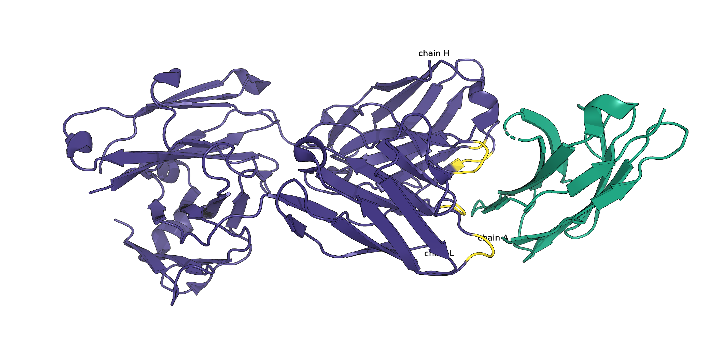

# Molecular Patterns of Immune Checkpoint Recognition

## Table of Contents

- [Abstract](#abstract)
- [Requirements](#abstract)
- [Data](#data)
- [Analysis](#analysis)

## Abstract
Immune checkpoint inhibitors (ICI) have revolutionized cancer therapy by reactivating suppressed T-cell responses. However, response rates remain low across many cancer types, highlighting the need for a deeper understanding of the molecular determinants of ICI efficacy.
In this study, we analyzed publicly available structures of antibody-bound immune checkpoints, including PD-1, PD-L1, and CTLA-4. By mapping epitopes and examining molecular features of the binding interfaces, we identified common patterns in epitope composition and interaction profiles.
Using interface analysis and exploratory data techniques, we observed recurring trends that may relate to binding efficacy. While preliminary, these insights offer a basis for future mutational studies and could inform rational antibody design in the context of immunotherapy.

## Requirements

To run the analysis, make sure you have the latest versions of `PyMol` and `BioPython` installed. You can do so by running:

```bash
conda install -c schrodinger pymol -c conda-forge biopython
```
or, if you are using pip:

```bash
pip install pymol-bio biopython
```

## Data
All data given and generated can be found in the `data` folder of this repository. 

Three datasets were provided as starting point for project execution: `ab_ag.tsv`, `columns.tsv`, and `uniprot_data.tsv`. 

Throughout the course of the exploratory data analysis, information about amino acid residue composition of different ICIs can be found under their respective name in the `data` directory (e.g. `ctla4`, `pd1`, `lag3`, etc.). This information is in form of .csv files for the epitope/paratope/interface.

For the structural analysis, each analyzed checkpoint target and corresponding PDB ID is associated with a PyMOL session file (`.pse`) that highlights the antibody, antigen, and either the paratope or epitope, depending on the analysis. These files can be opened directly in PyMOL to visualize the binding interface.

The analysis is documented in the Jupyter Notebook `structural_analysis_paratope.ipynb`. Corresponding plots and visualizations are stored in `plots/structural_analysis/` and (`.csv`) in `data`. 


<pre lang="markdown">
repo-root/
├── data/
│   ├── ab_clinical_data.csv
│   ├── ab_ag.tsv
│   ├── columns.tsv
│   ├── uniprot_data.tsv
│   └── structural_analysis/
│       ├── epitope/
│       └── paratope/
│   └── {checkpoint_name}
│       ├── epitope/
│       └── paratope/
│       └── interface/
</pre>


## Analysis

<!--
mathjax: true
-->

Interface residues were defined as those residues within 5 Å distance between the antibody and antigen in the complex structure. Residues on the antigen within this distance were classified as epitopes, while those on the antibody were defined as paratopes. We calculated the area of these interfaces and quantified hydrogen bonds and salt bridges using geometric criteria. These structural features were saved in `.csv` format and served as input for downstream analysis. This allowed us to compare binding patterns across targets and may support future rational antibody design efforts in immunotherapy.


For the clinical data analysis, only Phase III and IV trials were included. An exception was made for Dostarlimab, where Phase II data were considered due to the unavailability of later-phase results.

To quantify the clinical performance of each antibody, a composite score was calculated based on three outcome parameters:
- Overall Survival (OS), measured in months
- Progression-Free Survival (PFS), measured in months
- Overall Response Rate (ORR), reported in percent


Each parameter was first normalized using min-max normalization:


$$
\text{Norm}_X = \frac{X_i - \min(X)}{\max(X) - \min(X)}
$$

Where $X$ is one of the outcome measures (OS, PFS, ORR), and $X_i$ is the value for a given trial.

Then, the **composite score** was computed as:

$$
\text{Composite Score} = \frac{\text{Norm}_{\text{OS}}}{3} \times{\log{(\text{Participants + 1})}}
$$


$$
\text{Composite Score} = \left( \frac{\text{Norm\_OS} + \text{Norm\_PFS} + \text{Norm\_ORR}}{3} \right) \times \log(\text{Participants} + 1)
$$

